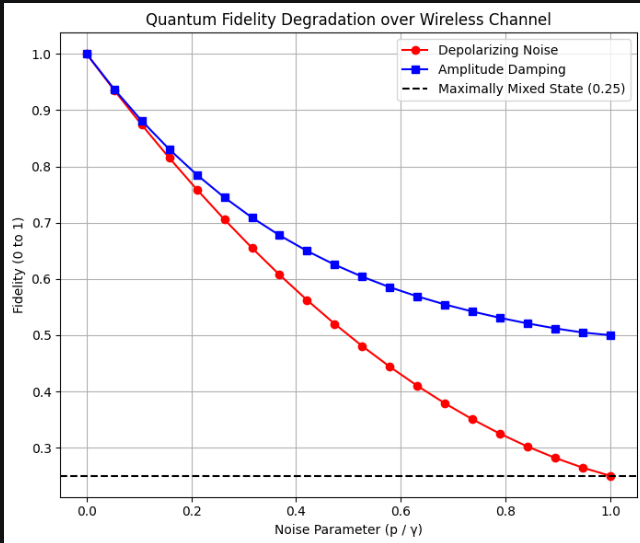
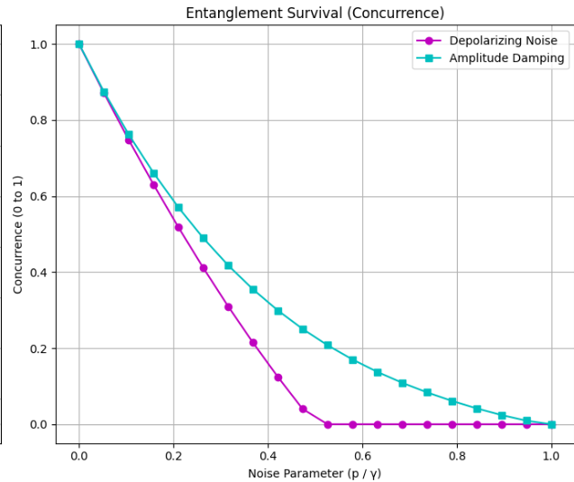

# Quantum-Secured IoT (Q-IoT): Wireless Entanglement Simulation

## Project Overview
The integration of Quantum Key Distribution (QKD) into Internet of Things (IoT) networks offers theoretically unbreakable cryptographic security. However, physical implementation is severely hindered by the fragility of quantum states transmitted over noisy wireless channels. 

This repository documents the end-to-end engineering journey of evaluating and mitigating the degradation of quantum entanglement under simulated atmospheric interference, and eventually applying these models to physical IoT hardware.

## Quantum Simulation & Mathematical Analysis
I utilized Python and the IBM Qiskit framework to generate an ideal $|\Phi^+\rangle$ Bell State and subject it to simulated wireless transmission. By mapping physical transmission distance (0 to 100 meters) to noise probability factors (0.0 to 1.0), the study mathematically tracked Decoherence through the extraction of quantum density matrices.

### Key Findings
* **Noise Modeling:** Compared Depolarizing Noise (random atmospheric scrambling) against Amplitude Damping (photon energy loss).
* **Fidelity Decay:** Demonstrated a predictable exponential decay in Quantum Fidelity.
* **The Theoretical Limit:** Proved that as simulated distance reaches 100 meters, the quantum state completely collapses into a maximally mixed state (Fidelity = 0.25). At this threshold, the system produces pure random static, mathematically stripping the system of any quantum cryptographic advantage.
* **Amplitude Damping Resilience:** Under Amplitude Damping (photon energy loss), Fidelity plateaus at **0.5**, as the system is forced into its ground state rather than being completely randomized.
* **Entanglement Sudden Death (ESD):** The Concurrence graph proves that the physical quantum link between the simulated transmitter and receiver is completely severed at the **0.5 noise mark** for Depolarizing Noise, dying long before the environment reaches maximum interference.

### Simulation Results
The graphs below illustrate the fatal impact of atmospheric interference on the quantum link, highlighting the difference between random static and signal energy loss.

<table>
  <tr>
    <td></td>
    <td></td>
  </tr>
</table>

### Simulation Repository Structure
The codebase was developed iteratively to document the raw engineering process, from initial pure-state Qiskit circuit testing to complex Amplitude Damping physics.
  * `graphs/` - Data visualization output.
  * `1.generating a bell state.ipynb` - Generation of the baseline uncorrupted quantum key.
  * `2.breaking the entanglement.ipynb` - Injecting random atmospheric static.
  * `3.entanglement degradation analysis.ipynb` - Mapping simulated distance to entanglement survival.
  * `4.fidelity calculation.ipynb` - Simulating photon energy loss.
  * `5.noise models comparison.ipynb` - Final model comparison and comparative graphs.
  * `combined_simulation_code.ipynb` - A refactored, single-script execution of the entire simulation pipeline.
    
## Quantum Key Extraction & Middleware Networking
I transitioned the theoretical Qiskit mathematical models into a functional, network-accessible cryptographic API to bridge the gap between simulation and physical hardware.

### Key Findings
* **Wave Function Collapse:** Added measurement gates and executed single-shot simulations (`shots=1`) to force the quantum superposition to collapse into a definitive classical bit string (e.g., `00` or `11`).
* **Flask API Middleware:** Engineered a lightweight local web server (`app.py`) to act as the translation bridge between the Python quantum simulation and the physical C++ hardware.
* **Network Delivery:** Configured the server to listen on `0.0.0.0` and serialized the quantum key into a universal JSON payload, allowing edge devices to request on-demand keys over the local Wi-Fi network via the `/get_key` endpoint.

### Quantum Key Extraction and Flask Server Repository Structure
This module contains the functional network server and the quantum extraction script.
* `quantum_key_generator.py` - Connects to IBM Qiskit `aer_simulator` to collapse the wave function and isolate a single classical bit string.
 * `app.py` - The Flask web server that routes the network requests and packages the output into JSON.

## Hardware-in-the-Loop Integration & Cloud Encryption
I integrated the theoretical quantum backend with physical edge hardware and engineered an automated cloud telemetry pipeline to create a fully operational, end-to-end cyber-physical system.

### How It Works 
1. **Sensing the Environment (The Edge Node):** An ESP32 microcontroller reads the physical room temperature using a DHT11 sensor.
2. **Quantum Locking (Hardware Encryption):** The ESP32 asks the local Python server for a fresh quantum key. It then uses a mathematical lock (Symmetrical Bitwise XOR cipher) to scramble the clean temperature reading into an unreadable hexadecimal string.
3. **Secure Transmission:** The scrambled data is uploaded to a public ThingSpeak IoT dashboard over Wi-Fi. If a hacker intercepts this transmission, they only see random numbers and letters.
4. **Unlocking & Graphing (Cloud Decryption):** A custom MATLAB script running continuously in the background on ThingSpeak grabs the scrambled data, uses the exact same quantum key to unlock it, and plots the true temperature onto a live web chart.

### Key Findings
* **Edge Node Encryption:** Successfully deployed an ESP32 edge device that fetches simulated quantum keys via local network calls and executes a Symmetrical Bitwise XOR cipher on live DHT11 temperature data before internet transmission.
* **Overcoming Cloud Rate Limits:** Identified and bypassed ThingSpeak’s public tier 15-second write lockout by implementing a custom `try-catch` exception handler in MATLAB, paired with an expanded 30-second hardware polling window to prevent network data collisions.
* **Resolving Data-Type Formatting Traps:** Prevented MATLAB matrix flattening and hidden timestamp injection errors by explicitly requesting `'OutputFormat', 'table'` and utilizing strict positional grid indexing (`data{1, 2}`) during cloud ingestion.

### Live Dashboard Results
The graphics below illustrate the live end-to-end cryptographic deployment state on ThingSpeak. The raw ciphertext stream shows extreme, secure scattering, while the automated MATLAB decryption engine simultaneously recovers the smooth, linear real-world ambient room temperature:

<table>
  <tr>
    <td></td>
    <td></td>
    <td></td>
  </tr>
</table>

### Hardware & Encryption Repository Structure
This folder contains the code that runs on the physical device and the code that runs in the cloud.
  * `dashboard/` - Directory housing live system verification images.
  * `esp32_firmware.ino` - The C++ code uploaded to the ESP32 to handle Wi-Fi, sensors, and the encryption math.
  * `cloud_decryption.m` - The MATLAB script running on ThingSpeak that handles the decryption and automated graphing.

## Tech Stack
* **Language:** Python, C++, MATLAB
* **Quantum Framework:** IBM Qiskit (`qiskit`, `qiskit_aer`)
* **Backend API / Middleware:** Flask
* **Hardware:** ESP32 (Wi-Fi SoC), DHT11 Sensor, SSD1306 OLED Display
* **Cloud Analytics:** ThingSpeak
* **Data Visualization:** Matplotlib
* **Environment:** Jupyter Notebooks / Command Line Interface
